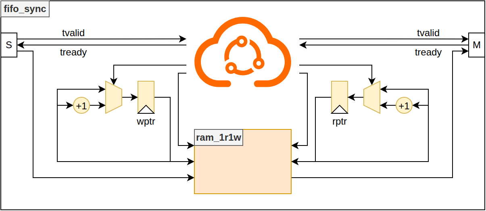

<!--
  README GENERATION INSTRUCTIONS (for the next regeneration run)
  ----------------------------------------------------------------
  This README follows the common Asylum IP model. Regenerate it from the
  sources, never from the previous README text alone.

  Sources of truth (in priority order):
    1. hdl/*.vhd            : entities, generics, ports, packages
    2. hdl/csr/*.hjson      : register map (regtool); *_csr.md/.h are generated
    3. <IP>.core            : VLNV (name), filesets, targets, depends, revisions
    4. mk/targets.txt       : target list shown by `make help`; mk/defs.mk
    5. sim/, syn/, esw/, boards/ : testbenches, constraints, software
  Section order (keep it, same headings in every IP):
    CI badge / Title + one-line description + VLNV / Table of Contents /
    Introduction (Key Features) / Block Diagram / Top-Level (Parameters,
    Ports, Instantiation Example) / HDL Modules / Register Map /
    Verification / Synthesis / Design Notes (optional) /
    Directory Structure / Dependencies
  Rules:
    - Language: English. Tables: Parameters = Name|Type|Default|Description,
      Ports = Name|Direction|Type|Description (grouped by interface).
    - Register Map: link to the generated hdl/csr/<X>_csr.md (plus the
      .hjson source and _csr.h header); never copy register tables here.
    - Top-Level = sbi_* wrapper if present, else the entity used by the
      `default` target, else the main entity (libraries: list packages).
    - Write "This IP has no software-visible registers." / "No dedicated
      synthesis target ..." instead of removing a section.
    - Keep still-accurate hand-written content (ISA tables, results,
      images) in "Design Notes"; drop anything not backed by the sources.
    - Block diagram: doc/<NAME>.drawio (NAME = 4th field of the VLNV),
      top entity box with generics on top, inputs left, outputs right,
      bus interfaces as bold arrows, internal blocks colour-coded
      (CSR yellow, FIFO/memory green, core logic blue, external grey).
      Update it whenever ports/generics/sub-blocks change.
    - Do not edit generated files (hdl/csr/*_csr.*) or the CI badge URL.
-->
[](https://github.com/deuskane/asylum-component-fifo/actions/workflows/ci.yml)

# asylum-component-fifo

**Single-clock FIFO with AXI-Stream-like write / read interfaces, fill-level outputs and selectable asynchronous or synchronous RAM read.**

VLNV: `asylum:component:fifo:1.2.1`

## Table of Contents

1. [Introduction](#introduction)
2. [Block Diagram](#block-diagram)
3. [Top-Level](#top-level)
4. [HDL Modules](#hdl-modules)
5. [Register Map](#register-map)
6. [Verification](#verification)
7. [Synthesis](#synthesis)
8. [Design Notes](#design-notes)
9. [Directory Structure](#directory-structure)
10. [Dependencies](#dependencies)

## Introduction

This IP is the generic synchronous FIFO of the Asylum project. `fifo_sync` stores words in a `ram_1r1w` instance (core `asylum:component:ram`) addressed by a write pointer and a read pointer, each with one extra wrap bit to distinguish full from empty. Producer and consumer use valid / ready handshakes (`s_axis_*` and `m_axis_*`), and both sides get the full / empty flags and the number of free or stored words. The `SYNC_READ` generic selects whether the internal RAM is read combinationally or through a registered read port (better suited to block-RAM inference).

### Key Features

- Single clock domain (`clk_i`), asynchronous active-low reset (`arst_b_i`)
- Generic data width (`WIDTH`) and depth (`DEPTH`, power of 2)
- Write side: `s_axis_tvalid_i` / `s_axis_tready_o` / `s_axis_tdata_i`, `s_axis_tready_o = not full`
- Read side: `m_axis_tvalid_o` / `m_axis_tready_i` / `m_axis_tdata_o`, `m_axis_tvalid_o = not empty`
- Full and empty flags available on both sides, number of free words (`s_axis_nb_elt_empty_o`) and stored words (`m_axis_nb_elt_full_o`)
- `SYNC_READ = false`: asynchronous RAM read; `SYNC_READ = true`: synchronous RAM read with an output register for a written word that becomes the head immediately (write into an empty FIFO, or write and read in the same cycle with one stored word)
- Simulation-only assertion `nb_elt_full + nb_elt_empty = DEPTH`
- Component declaration available in `asylum.fifo_pkg`

## Block Diagram



- `wptr` and `rptr` are `ADDR+1`-bit counters (`ADDR = clog2(DEPTH)`), incremented on a write handshake (`s_axis_tvalid_i and s_axis_tready_o`) and a read handshake (`m_axis_tvalid_o and m_axis_tready_i`).
- The flag logic compares the pointers: equal LSBs and equal MSB = empty, equal LSBs and different MSB = full; it also computes the stored / free word counts.
- `ins_RAM` (`ram_1r1w`, `cke_i = '1'`) is written at `wptr` with `s_axis_tdata_i` on every write handshake.
- `SYNC_READ = false`: `m_axis_tdata_o` is the combinational RAM read at `rptr`.
- `SYNC_READ = true`: the RAM reads `rptr+1` when `m_axis_tready_i = 1`; an output register captures the written word when it is the next head and cannot come from the RAM (write into an empty FIFO, or push and pop in the same cycle with one stored word), and is bypassed by the RAM output once consumed.

## Top-Level

Top-level entity: **`fifo_sync`** ([hdl/fifo_sync.vhd](hdl/fifo_sync.vhd)), library `asylum`, component declared in `asylum.fifo_pkg`.

### Parameters

| Name | Type | Default | Description |
|------|------|---------|-------------|
| `WIDTH` | natural | `8` | Data width in bits |
| `DEPTH` | natural | `4` | Number of words; must be a power of 2 (pointer arithmetic wraps at `2**clog2(DEPTH)` and `ram_1r1w` uses `log2(DEPTH)` address bits) |
| `SYNC_READ` | boolean | `false` | `false`: asynchronous read of the internal RAM; `true`: synchronous RAM read + output register |

### Ports

#### Clock & Reset

| Name | Direction | Type | Description |
|------|-----------|------|-------------|
| `clk_i` | in | std_logic | Clock |
| `arst_b_i` | in | std_logic | Asynchronous reset, active low (clears pointers and output register) |

#### AXI-Stream Slave (Write Side)

| Name | Direction | Type | Description |
|------|-----------|------|-------------|
| `s_axis_tvalid_i` | in | std_logic | Write request |
| `s_axis_tready_o` | out | std_logic | FIFO not full: the word is accepted when `s_axis_tvalid_i = 1` |
| `s_axis_tdata_i` | in | std_logic_vector(WIDTH-1 downto 0) | Write data |
| `s_axis_nb_elt_empty_o` | out | std_logic_vector(clog2(DEPTH) downto 0) | Number of free words |
| `s_axis_full_o` | out | std_logic | FIFO full |
| `s_axis_empty_o` | out | std_logic | FIFO empty |

#### AXI-Stream Master (Read Side)

| Name | Direction | Type | Description |
|------|-----------|------|-------------|
| `m_axis_tvalid_o` | out | std_logic | FIFO not empty: `m_axis_tdata_o` is valid |
| `m_axis_tready_i` | in | std_logic | Read acknowledge: the word is consumed when `m_axis_tvalid_o = 1` |
| `m_axis_tdata_o` | out | std_logic_vector(WIDTH-1 downto 0) | Read data (oldest word) |
| `m_axis_nb_elt_full_o` | out | std_logic_vector(clog2(DEPTH) downto 0) | Number of stored words |
| `m_axis_full_o` | out | std_logic | FIFO full (same signal as `s_axis_full_o`) |
| `m_axis_empty_o` | out | std_logic | FIFO empty (same signal as `s_axis_empty_o`) |

### Instantiation Example

```vhdl
library asylum;
use     asylum.fifo_pkg.all;

  ins_fifo : entity asylum.fifo_sync
    generic map
    ( WIDTH                 => 16
     ,DEPTH                 => 32
     ,SYNC_READ             => true
    )
    port map
    ( clk_i                 => clk
     ,arst_b_i              => arst_b
     ,s_axis_tvalid_i       => producer_valid
     ,s_axis_tready_o       => producer_ready
     ,s_axis_tdata_i        => producer_data    -- std_logic_vector(15 downto 0)
     ,s_axis_nb_elt_empty_o => fifo_nb_free     -- std_logic_vector( 5 downto 0)
     ,s_axis_full_o         => fifo_full
     ,s_axis_empty_o        => open
     ,m_axis_tvalid_o       => consumer_valid
     ,m_axis_tready_i       => consumer_ready
     ,m_axis_tdata_o        => consumer_data    -- std_logic_vector(15 downto 0)
     ,m_axis_nb_elt_full_o  => fifo_nb_used     -- std_logic_vector( 5 downto 0)
     ,m_axis_full_o         => open
     ,m_axis_empty_o        => fifo_empty
    );
```

## HDL Modules

| File | Unit | Kind | Role |
|------|------|------|------|
| [hdl/fifo_pkg.vhd](hdl/fifo_pkg.vhd) | `fifo_pkg` | package | Component declaration of `fifo_sync` |
| [hdl/fifo_sync.vhd](hdl/fifo_sync.vhd) | `fifo_sync` | entity | Top-level: pointers, flags, `ram_1r1w` instance, optional output register |

There is no secondary entity in this IP; the storage is the `ram_1r1w` entity of `asylum:component:ram`.

## Register Map

This IP has no software-visible registers.

## Verification

### Testbenches

| File | DUT | Description |
|------|-----|-------------|
| [sim/fifo_sync_tb.vhd](sim/fifo_sync_tb.vhd) | `fifo_sync` (`WIDTH = 8`, `DEPTH` and `SYNC_READ` from generics, `DEPTH = 16` by default) | VHDL-2008 testbench using the UVVM AXI-Stream BFM (`bitvis_vip_axistream`). Figures below are for `DEPTH = 16`: 1) write min(5, DEPTH) words then read and check them; 2) fill the FIFO (16 words) and drain it; 3) 32 alternated write / expect pairs; 4) half-fill then alternate write / expect, then drain; 5) overflow: a 17th write must time out on `s_axis_tready_o` (expected warning), then drain; 6) underflow: `m_axis_tvalid_o` must be 0 after reset and a receive must time out (expected warning); 7) simultaneous push and pop at every fill level from 0 to 16 (one isolated push+pop, then 4 back-to-back push+pop, then drain); 8) 1200 cycles of random push / pop with 4 probability profiles (toward full, toward empty, balanced). Tests 7 and 8 drive the handshakes directly and compare every cycle against a scoreboard: data order on each pop, `m_axis_tvalid_o`, `s_axis_tready_o`, both `*_full_o` / `*_empty_o` flags and both `*_nb_elt_*_o` counts (13622 cycle checks per target). A reset is applied before each test; `report_alert_counters(FINAL)` gives the verdict |

### Targets

| Target | Toplevel | Description |
|--------|----------|-------------|
| `default` | *(none)* | HDL fileset only (not a simulation) |
| `lint_ghdl` | `asylum.fifo_sync` | Lint with GHDL: `-Wall` analysis and elaboration of `fifo_sync` with default generics (part of `make nonreg_lint`) |
| `sim_fifo_depth1_read_async` | `fifo_sync_tb` | Testbench with `DEPTH=1`, `SYNC_READ=false` (empty / full flags of a single-word FIFO) |
| `sim_fifo_depth1_read_sync` | `fifo_sync_tb` | Testbench with `DEPTH=1`, `SYNC_READ=true` |
| `sim_fifo_sync_read_async` | `fifo_sync_tb` | Testbench with `SYNC_READ=false` (asynchronous RAM read) |
| `sim_fifo_sync_read_sync` | `fifo_sync_tb` | Testbench with `SYNC_READ=true` (synchronous RAM read) |

### How to Run

The default tool is GHDL (`mk/defs.mk`: `TOOL ?= ghdl`, `TARGET ?= sim_fifo_sync_read_sync`).

```bash
make help                 # variables, rules and target list (mk/targets.txt)
make sim_fifo_sync_read_sync   # run one target (log in log/)
make nonreg_sim           # run every sim_* target
make nonreg_lint          # run every lint_* target (lint_ghdl)
make clean                # remove build/
```

Equivalent FuseSoC command:

```bash
fusesoc --cores-root . run --build-root build --target sim_fifo_sync_read_sync asylum:component:fifo:1.2.1
```

### Simulation Features

- Both `sim_*` targets analyze with `-Wall -fsynopsys -frelaxed --no-vital-checks` and run with `--fst=dut.fst --ieee-asserts=disable` (waveform always written to `dut.fst`).
- `fifo_sync` checks `nb_elt_full + nb_elt_empty = DEPTH` on every clock edge (severity error), inside `synthesis translate_off`; the check is skipped while the pointers hold metavalues (before the first reset).

## Synthesis

The `lint_ghdl` target (GHDL, `analyze_options: ["-Wall"]`, toplevel `asylum.fifo_sync`) is the only static check; there is no `emu_*` target and no constraint file. The HDL of the `default` target is synthesizable: the only simulation construct of `fifo_sync` (the fill-level assertion) is enclosed in `synthesis translate_off / translate_on`. Resource usage is set by `WIDTH x DEPTH` bits of RAM plus two `clog2(DEPTH)+1`-bit pointers; `SYNC_READ = true` gives a registered RAM read port (block-RAM friendly) and adds a `WIDTH`-bit output register, `SYNC_READ = false` requires a RAM with asynchronous read (distributed RAM / registers).

## Design Notes

### Pointers and Flags

- `empty = (wptr(ADDR-1:0) = rptr(ADDR-1:0)) and (wptr(ADDR) = rptr(ADDR))`
- `full  = (wptr(ADDR-1:0) = rptr(ADDR-1:0)) and (wptr(ADDR) /= rptr(ADDR))`
- `nb_elt_full  = (msb_ne & wptr(ADDR-1:0)) - (0 & rptr(ADDR-1:0))`
- `nb_elt_empty = (msb_eq & rptr(ADDR-1:0)) - (0 & wptr(ADDR-1:0))`

All flags and counts are combinational functions of the pointers, so they change on the clock edge following a handshake. A write is refused only when the FIFO is full (no simultaneous push / pop on a full FIFO).

### SYNC_READ Mode

- The RAM read port is enabled by `m_axis_tready_i` and addressed by `rptr+1`, so after a pop the next word is already in the RAM output register.
- A word written while the FIFO is empty is captured directly from `s_axis_tdata_i` into `m_axis_tdata_r` (`m_axis_tvalid_r = 1`); `m_axis_tdata_o` selects this register while `m_axis_tvalid_r = 1`, else the RAM output.
- A push and a pop in the same cycle with exactly one stored word (`wptr = rptr+1`) make the written word the next head while the RAM is read at the address being written (read-during-write returns the old content): this word is also captured into `m_axis_tdata_r`. Before version 1.2.1 this case returned a stale RAM word; tests 7 and 8 cover it.
- `DEPTH = 1`: there is no address bit (`ADDR = 0`), empty / full only depend on the lap bit (`gen_ptr_lsb_eq_depth1`). Before version 1.2.1 the comparison of the two null address slices made the FIFO look non-empty after reset; targets `sim_fifo_depth1_*` cover it.

## Directory Structure

```
asylum-component-fifo/
├── FIFO.core               # FuseSoC core (asylum:component:fifo)
├── Makefile                # Common Asylum Makefile (FuseSoC wrapper)
├── mk/
│   ├── defs.mk             # FILE_CORE, default TARGET and TOOL
│   └── targets.txt         # Target list (generated from the .core)
├── doc/
│   └── fifo.drawio         # Block diagram
├── hdl/
│   ├── fifo_pkg.vhd
│   └── fifo_sync.vhd
├── sim/
│   └── fifo_sync_tb.vhd    # UVVM AXI-Stream testbench
└── .github/workflows/ci.yml  # CI (sim_fifo_depth1_read_*, sim_fifo_sync_read_*)
```

## Dependencies

| Core | Used by (fileset) | Purpose |
|------|-------------------|---------|
| `asylum:utils:pkg` | `hdl` | Common packages (`math_pkg`: `clog2`, `log2`) |
| `asylum:component:ram` | `hdl` | `ram_1r1w` storage (`ram_pkg`) |
| `bitvis:verification:uvvm` | `sim_basic` | UVVM utility library and AXI-Stream BFM (`bitvis_vip_axistream`) |
